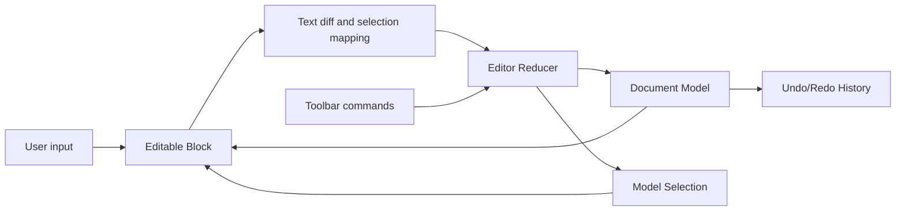

# Rich Text Editor

A small rich text editor built with React, TypeScript, and Vite. The editor uses a document model with text runs and inline marks, while React context and a reducer manage editing state.

## Features

- Editable single-block writing surface
- Bold, italic, and link formatting
- Undo and redo history
- Selection-aware toolbar state
- Enter inserts a newline in the current block
- Live word count
- Document normalization and JSON serialization
- HTML escaping when rendering editable content
- Unit tests for model, selection, history, and reconciliation logic

## Requirements

- Node.js 18 or newer
- npm

## Getting Started

Install dependencies:

```bash
npm install
```

Start the development server:

```bash
npm run dev
```

Open the local URL printed by Vite in your browser.

## Available Commands

| Command                | Description                                |
| ---------------------- | ------------------------------------------ |
| `npm run dev`          | Start the Vite development server          |
| `npm run build`        | Type-check and build the production bundle |
| `npm run preview`      | Preview the production build locally       |
| `npm run typecheck`    | Run TypeScript without emitting files      |
| `npm run lint`         | Check source files with ESLint             |
| `npm run lint:fix`     | Automatically fix supported lint issues    |
| `npm run format`       | Format the project with Prettier           |
| `npm run format:check` | Check formatting without changing files    |
| `npm test`             | Run the Vitest test suite once             |
| `npm run test:watch`   | Run Vitest in watch mode                   |

## How It Works

The editor stores content as a document containing blocks. Each block contains text runs, and each run can contain inline marks such as `bold`, `italic`, or a link object.

The application state is managed by `editorReducer` and exposed through `EditorProvider`. Components such as the toolbar and editable block use `useEditorContext()` to read state and dispatch commands without passing editor state through multiple component props.

Input changes are reconciled by comparing the previous and current text values. The resulting diff is applied to the document model, the caret is normalized, and the change is added to the history stack. Undo and redo restore both the document and its selection.

## High-Level Design

The editor follows one central rule: the document model owns the content, and the DOM only displays it and reports user input.

### Runtime Flow

1. `App` creates an `EditorProvider` around the editor workspace.
2. `EditorProvider` owns the reducer state, current selection, commands, and history.
3. `Editor` reads the current document from context and renders the toolbar and editable block.
4. `Block` reads browser input and selection events from the `contenteditable` surface.
5. Input is converted into a typed reducer action and reconciled into the document model.
6. React renders the updated model back into the block, and the caret is restored from model offsets.
7. `Toolbar` dispatches formatting, link, undo, and redo commands through the same context.



### Main Responsibilities

| Area                      | Responsibility                                                                         |
| ------------------------- | -------------------------------------------------------------------------------------- |
| `model/`                  | Defines documents, blocks, text runs, marks, normalization, and replacement operations |
| `editor-core/reconciler/` | Converts browser text changes into model updates                                       |
| `editor-core/selection/`  | Converts and clamps selection positions between DOM and model coordinates              |
| `editor-core/history/`    | Stores document and selection snapshots for undo and redo                              |
| `hooks/editor/`           | Defines reducer state, actions, commands, and selectors                                |
| `hooks/useEditor.ts`      | Exposes editor state and actions through React context                                 |
| `components/Block/`       | Projects model content into the editable DOM and captures browser events               |
| `components/Toolbar/`     | Presents formatting, link, and history actions                                         |

### Example State Flow

When a user selects `hello` and clicks Bold:

1. `Block` stores the selection as block ID plus character offsets.
2. `Toolbar` dispatches the Bold command through context.
3. The reducer calls the mark operation for the selected range.
4. The model is normalized and stored in history with its selection.
5. `Block` renders the marked run and restores the selection.

For more detail, see [ARCHITECTURE.md](ARCHITECTURE.md) and [DECISIONS.md](DECISIONS.md).

## Project Structure

```text
src/
   components/
      Block/       Editable document block
      Editor/      Editor workspace
      Toolbar/     Formatting and history controls
   editor-core/
      commands.ts  Editor command definitions
      history/     Undo and redo stack
      reconciler/  DOM input diffing and model updates
      selection/   DOM and model selection conversions
   hooks/
      useEditor.ts Editor context and reducer integration
      editor/      State, actions, reducer, and selectors
   model/
      blocks/      Block operations
      document/    Document creation, validation, and normalization
      marks/       Inline mark operations
      runs/        Text-run operations
   utils/         Test and model construction helpers
```

## Testing

Run the complete test suite with:

```bash
npm test
```

The tests cover document normalization, text replacement, mark operations, selection conversion, history behavior, and input reconciliation.
